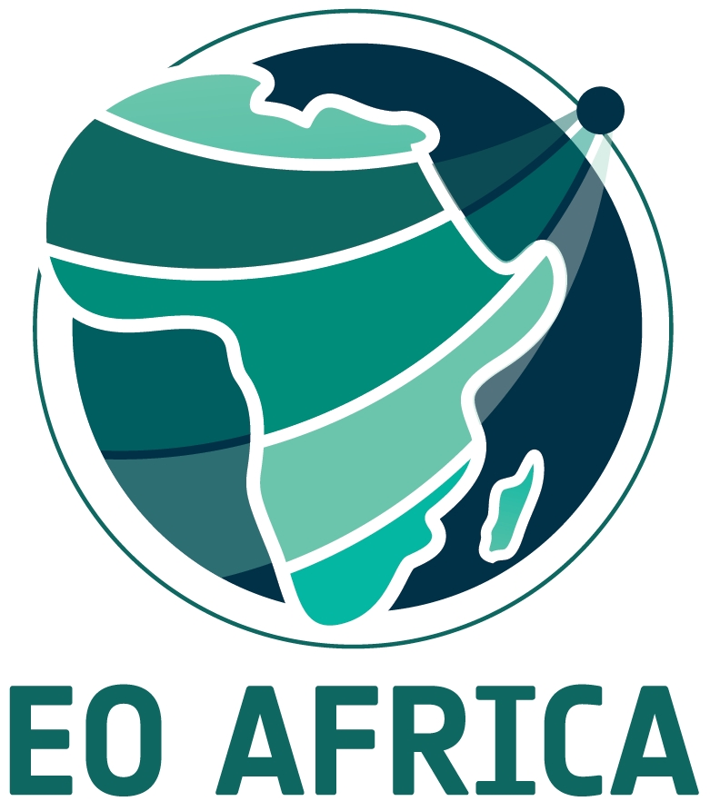

# Extracting information from satellite remote sensing

Part of EOAfrica R&D Facility course material:

* Training Module 6 & Online Course 4: Vegetation and Drought Monitoring from Space

**Authors: dr. Jeroen Degerickx & Christophe Metsu**

Organisation: VITO Remote Sensing [(website)](https://remotesensing.vito.be/)

## Introduction
In this series of exercises we will be covering a number of interesting satellite data products in the light of vegetation and drought monitoring. For each of those, we will see how to acquire the products and process them into meaningful information.

## Contents

* Exercise 6.2.1:
Introduction to raster calculations in Python, specifically for computing simple vegetation indices from optical remote sensing data.

* Exercise 6.2.2:
Exploration of MODIS time series and how to compute anomalies. We specifically look into NDVI and LST.

* Exercise 6.2.3:
Exploration of the WaPOR data portal: which products are available and how to download data from the portal.

* Exercise 6.2.4:
Exploration of other data portals/products relevant for drought monitoring.
